# OVERVIEW
PyTorch version: 0.4.1 | Python 3.6.5

Annotated implementations with comparative introductions for minimax, non-saturating, wasserstein, wasserstein gradient penalty, least squares, deep regret analytic, bounded equilibrium, relativistic, f-divergence, Fisher, and information generative adversarial networks (GANs), and standard, variational, and bounded information rate variational autoencoders (VAEs).

Paper links are supplied at the beginning of each file with a short summary of the paper. See src folder for files to run via terminal, or notebooks folder for Jupyter notebook visualizations via your local browser. The main file changes can be see in the train, train_D, and train_G of the Trainer class, although changes are not completely limited to only these two areas (e.g. Wasserstein GAN clamps weight in the train function, BEGAN gives multiple outputs from train_D, fGAN has a slight modification in viz_loss function to indicate method used in title).

All code in this repository operates in a generative, unsupervised manner on binary (black and white) MNIST. The architectures are compatible with a variety of datatypes (1D, 2D, 3D) and plotting functions work with binary/RGB images too. If a GPU is detected, the models use it. Otherwise, they default to CPu.

# ARCHITECTURES
The architecture chosen in these implementations for both the generator (G) and discriminator (D) consists of a simple, two-layer feedforward network. While this will give sensible output for MNIST, in practice it is recommended to use deep convolutional architectures (i.e. DCGANs) to get nicer outputs. This can be done by editing the Generator and Discriminator classes for GANs, or the Encoder and Decoder classes for VAEs.

# VIZ
All models were trained for 25 epochs with hidden dimension 400, latent dimension 20. Other implementation specifics are as close to the respective original paper (linked) as possible.

*Model* | *Epoch 1* | *Epoch 25* | *Progress* | *Loss*
:---: | :---: | :---: | :---: | :---: |
[MMGAN](https://arxiv.org/abs/1406.2661) | 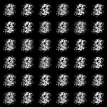 | 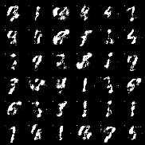 |  | 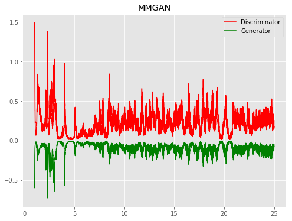
[NSGAN](https://arxiv.org/abs/1406.2661) | 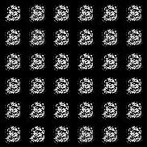 | 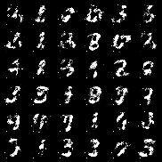 |  | 
[WGAN](https://arxiv.org/abs/1701.07875) |  | 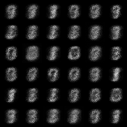 |  | 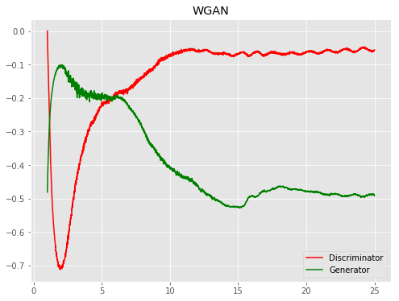
[WGANGP](https://arxiv.org/abs/1704.00028) | 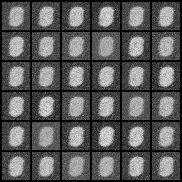 |  |  | 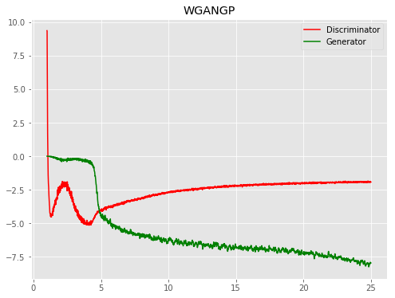
[DRAGAN](https://arxiv.org/abs/1705.07215) | 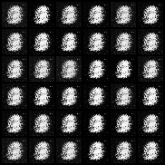 | 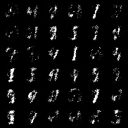 |  | 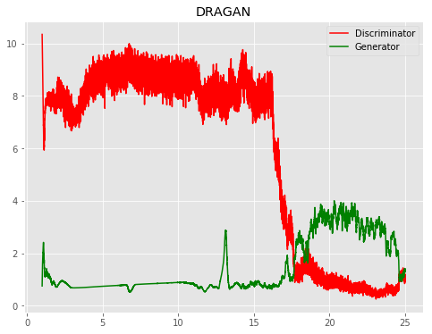
[BEGAN](https://arxiv.org/abs/1703.10717) | 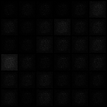 | 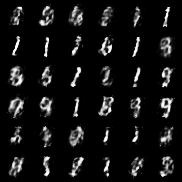 |  | 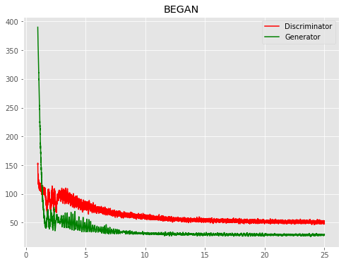
[LSGAN](https://arxiv.org/abs/1611.04076) | 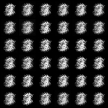 | 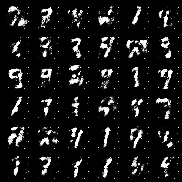 |  | 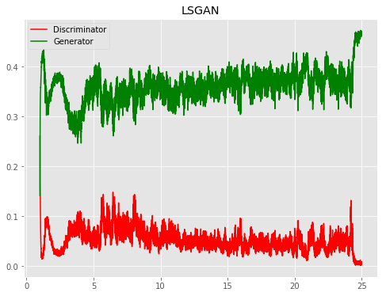
[RaNSGAN](https://arxiv.org/abs/1807.00734) | 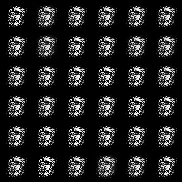 | 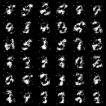 |  | 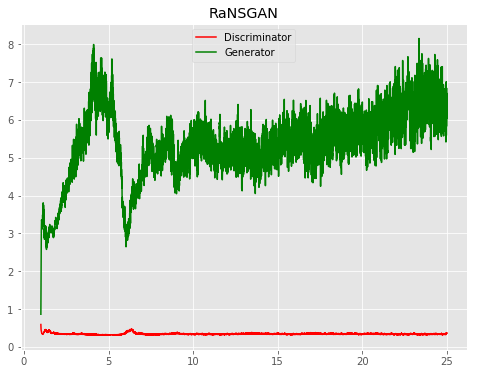
[FisherGAN](https://arxiv.org/abs/1606.07536) | 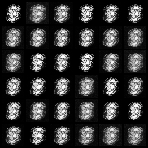 | 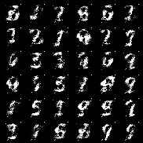 |  | 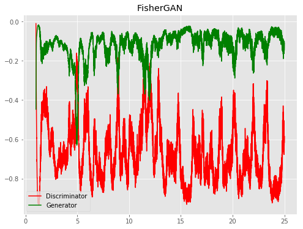
[InfoGAN](https://arxiv.org/abs/1606.03657) | 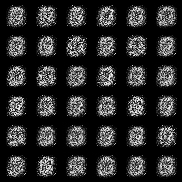 | 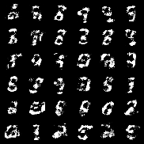 |  | 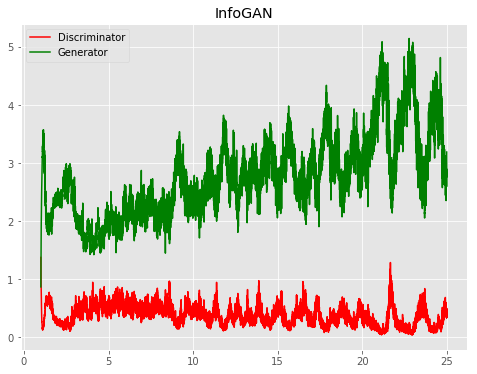
[f-TVGAN](https://arxiv.org/abs/1606.00709) | 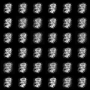 | 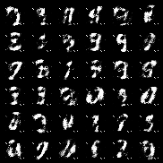 |  | 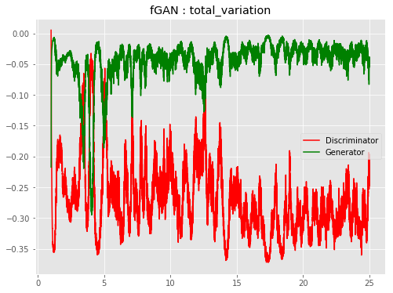
[f-PearsonGAN](https://arxiv.org/abs/1606.00709) | 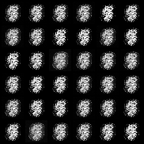 | 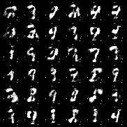 |  | 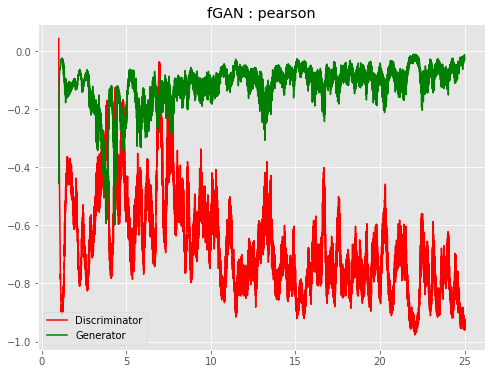
[f-JSGAN](https://arxiv.org/abs/1606.00709) | 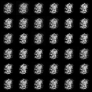 | 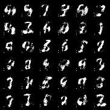 |  | 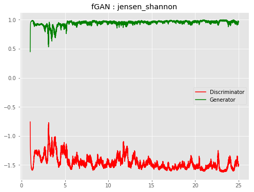
[f-ForwGAN](https://arxiv.org/abs/1606.00709) | 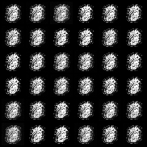 | 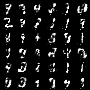 |  | 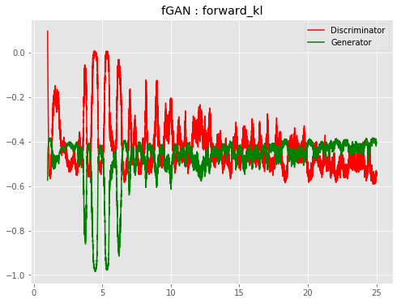
[f-RevGAN](https://arxiv.org/abs/1606.00709) | 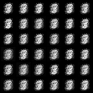 | 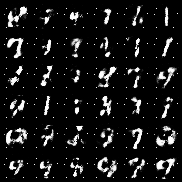 |  | 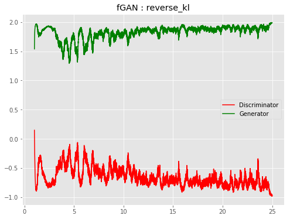
[f-HellingerGAN](https://arxiv.org/abs/1606.00709) | 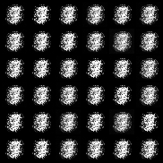 | 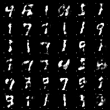 |  | 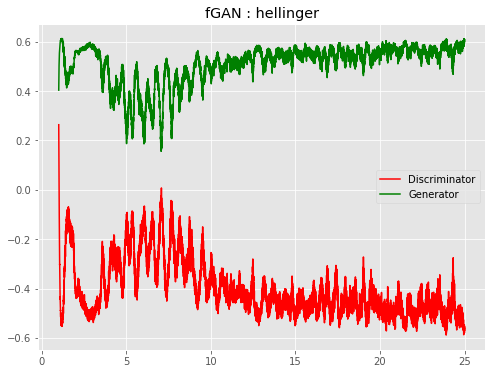
[VAE](https://arxiv.org/abs/1312.6114) | 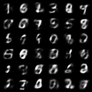 | 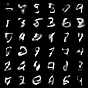 |  | 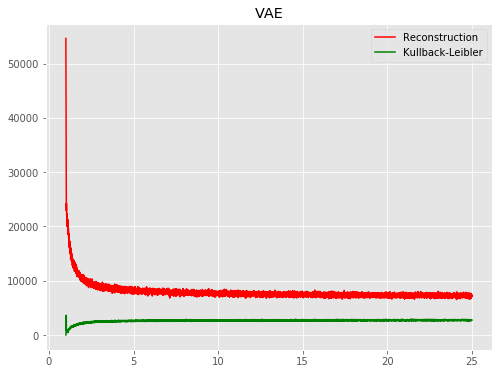
[BIRVAE](https://arxiv.org/abs/1807.07306) | 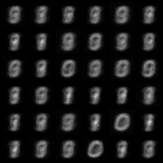 | 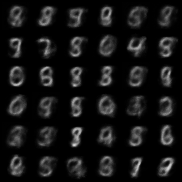 |  | 

# TODO
Models: CVAE, denoising VAE, adversarial autoencoder | Bayesian GAN, Self-attention GAN, Primal-Dual Wasserstein GAN  
Architectures: Add DCGAN option  
